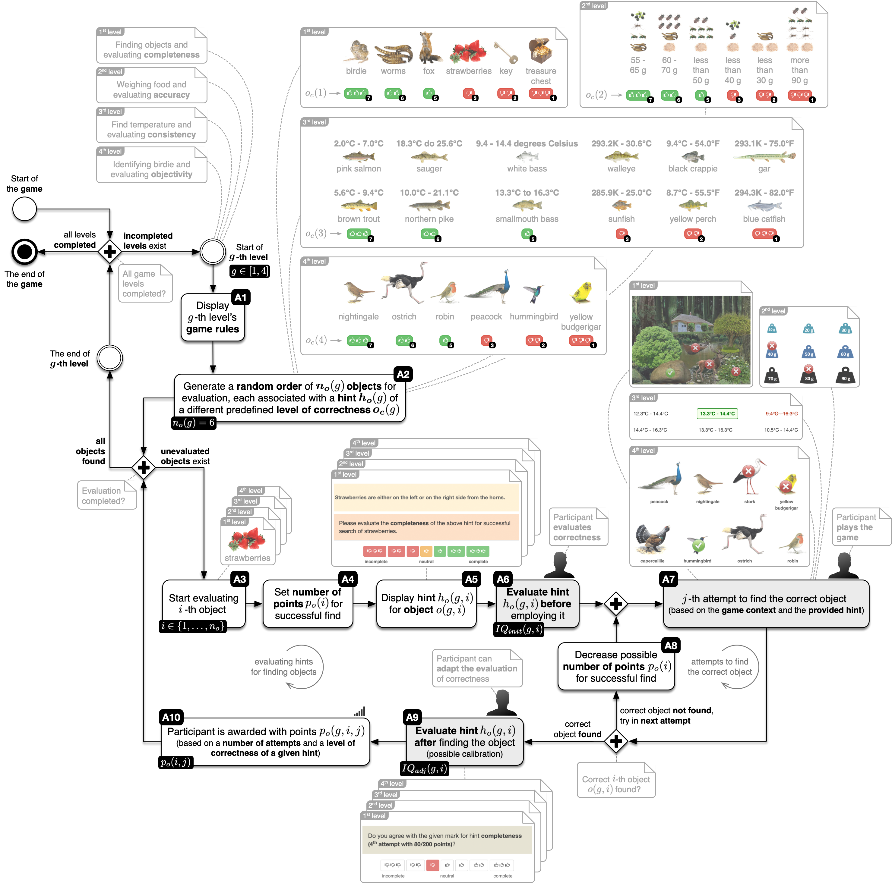

# Measuring how motivation affects information quality assessment: a gamification approach

> Marko Poženel, Aljaž Zrnec, Dejan Lavbič

## Abstract

**Purpose** - Existing research on the measurability of information quality (IQ) has delivered poor results and demonstrated low inter-rater agreement measured by Intra-Class Correlation (ICC) in evaluating IQ dimensions. Low ICC could result in a questionable interpretation of IQ. The purpose of this paper is to analyse whether assessors’ motivation can facilitate ICC.

**Methodology** - To acquire the participants’ views of IQ, we designed a survey as a gamified process. Additionally, we selected Web study to reach a broader audience. We increased the validity of the research by including a diverse set of participants (i.e. individuals with different education, demographic and social backgrounds).

**Findings** - The study results indicate that motivation improved the ICC of IQ on average by 0.27, demonstrating an increase in measurability from poor (0.29) to moderate (0.56). The results reveal a positive correlation between motivation level and ICC, with a significant overall increase in ICC relative to previous studies. The research also identified trends in ICC for different dimensions of IQ with the best results achieved for completeness and accuracy.

**Practical implications** - The work has important practical implications for future IQ research and suggests valuable guidelines. The results of this study imply that considering raters’ motivation improves the measurability of IQ substantially.

**Originality** - Previous studies addressed ICC in IQ dimension evaluation. However, assessors’ motivation has been neglected. This study investigates the impact of assessors’ motivation on the measurability of IQ. Compared to the results in related work, the level of agreement achieved with the most motivated group of participants was superior.

## Data

The following repository contains accompanying data for the research paper **Measuring how motivation affects information quality assessment: a gamification approach**. The data is stored in the [**`data`**](data) folder with the following files [`participants.csv`](data/participants.csv) and [`IQ_evaluation.csv`](data/IQ_evaluation.csv).

### Participants

Additional information about 1,062 participants is stored in the [`participants.csv`](data/participants.csv) file. The file contains the following columns:

- **`participant_ID`** - participant's unique identifier (`string` value),
- **`gender`** - participant's gender (`string` value of either `male` or `female`),
- **`age`** - participant's age (`integer` value),
- **`bothered_about_poor_IQ`** - level of disturbance of participant by poor IQ (Lickert scale `string` value from `not annoyed`, `slightly annoyed`, `I can't say`, `annoyed` to `very annoyed`),
- **`student`** - whether a participant is a student (`boolean` value).

| `participant_ID`                       | `gender` | `age` | `bothered_about_poor_IQ` | `student` |
| -------------------------------------- | :------: | :---: | :----------------------: | :-------: |
| `0041a13f-20b7-479b-8fb0-beabbfebaa2f` |  `male`  | `19`  |        `annoyed`         |  `TRUE`   |
| ...                                    |   ...    |  ...  |           ...            |    ...    |

### IQ evaluation

Additional information about participants' IQ evaluation is stored in the [`IQ_evaluation.csv`](data/IQ_evaluation.csv) file. The file contains the following columns:

- **`participant_ID`** - participant's unique identifier (`string` value),
- **`game_level`** - game level $g$ (`integer` value with values from `1` to `4`),
- **`IQ_dimension`** - IQ dimension corresponding to `game_level`(`string` value of either `completeness`, `representation`, `objectivity` or `accuracy`),
- **`object`** - object $o(g,i)$ is the $i$-th object within game level $g$ that hint $h_o(g,i)$ under evaluation is related to (`string` value, $6$ per game level, $24$ in total),
- **`level_of_correctness`** - predefined level of correctnes $o_c(g)$ used for hints $h_o(g,i)$ (`integer` value with values from `1`, `2`, `3` and `4`, `5`, `6`),
- **`hint_evalution`** - participant's evaluation of hint $h_o(g,i)$ (`integer` value on Lickert scale with values from `1` to `7`),
- **`points_received`** - points received $p_o(i,j)$ by participant in $j$ attempts at game level $i$ for hint $h_o(g,i)$ (`integer` value with values from `0` to `300`).

`participant_ID` | `game_level` | `IQ_dimension` | `object` | `level_of_correctnes` | `hint_evaluation` | `points_received`
:---: | :---: | :---: | :---: | :---: | :---: | :---:
`0041a13f-20b7-479b-8fb0-beabbfebaa2f` | `1` | `completeness` | `key` | `6` | `7` | `100`
... | ... | ... | ... | ... | ... | ...